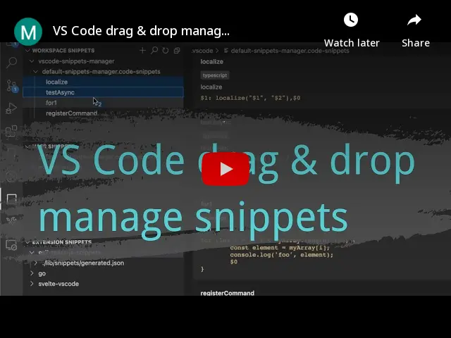
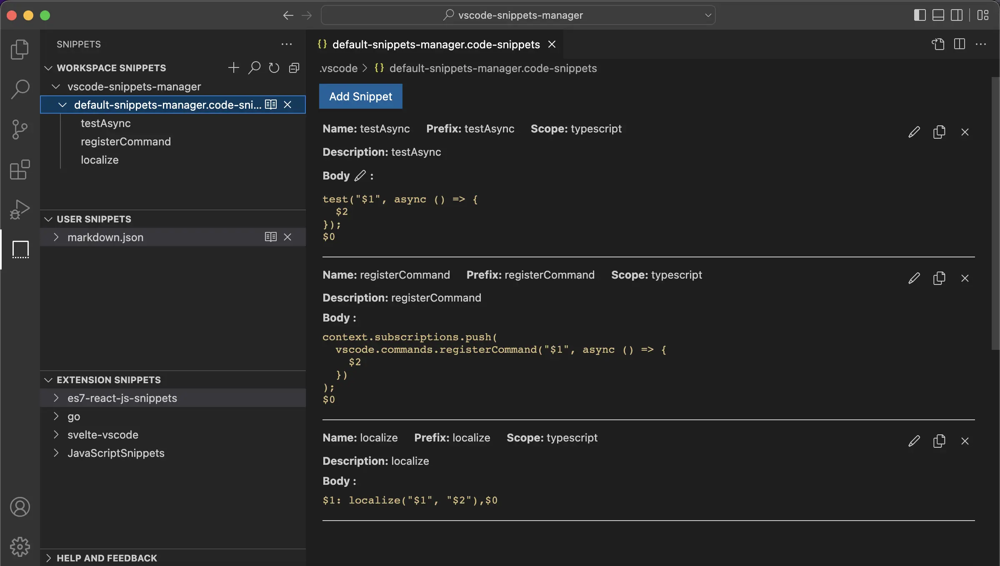
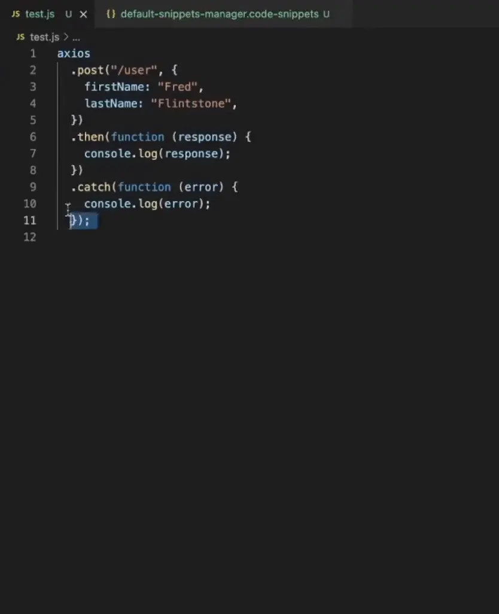
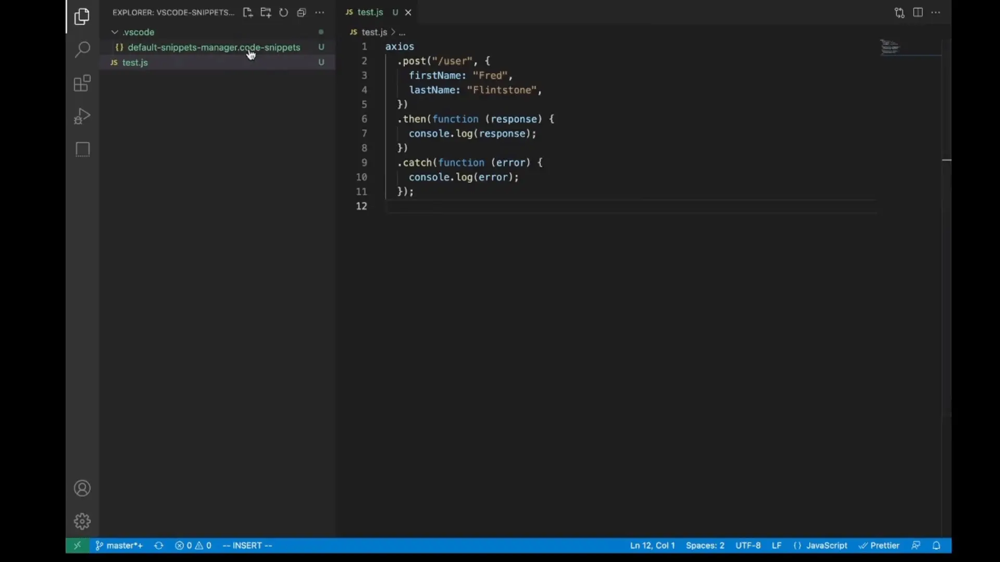
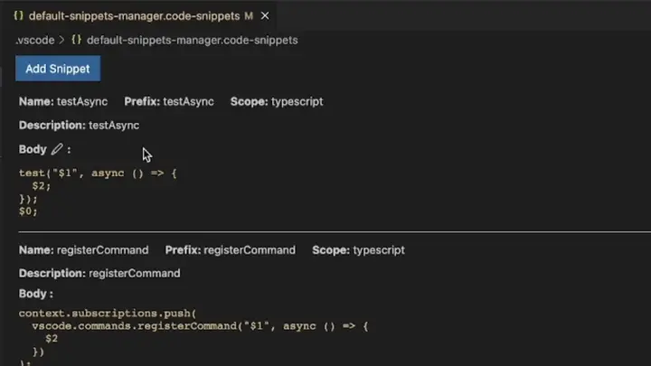
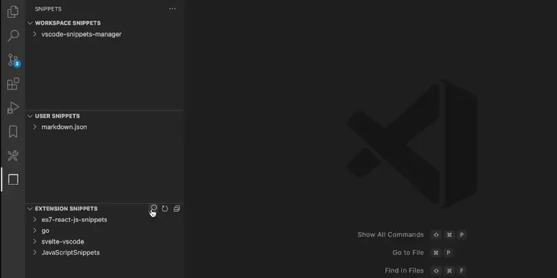
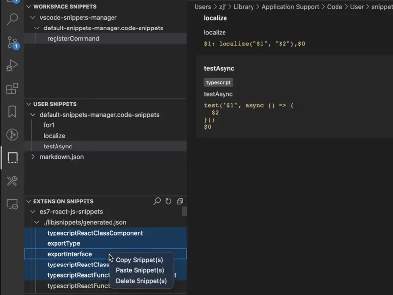
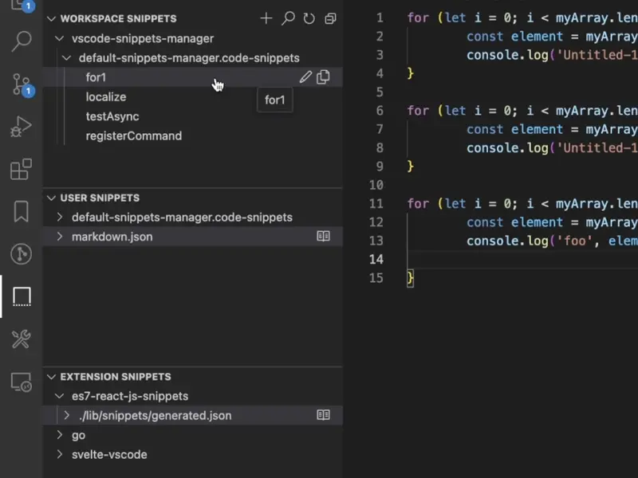

# Snippets Manager

English | [简体中文](./README.zh-CN.md)

Create and edit snippets easily.

This extension is built over the default [VS Code snippets](https://code.visualstudio.com/docs/editor/userdefinedsnippets) system, wrapping it into a nice and intuitive UI, improving usability, and making snippets easy to create, edit, delete and search. It supports user-custom snippets, global snippets and snippets from installed extensions.

[](https://www.youtube.com/embed/xhrl1eCmX5Q)

## Features

### Manage snippets

Create, edit, delete or search snippets.



### Create snippets

Select range to create a snippet.



- In order to make the content output by the snippet consistent with the selected content, we will automatically escape `\` in the body of the snippet to `\\` and `$` to `\$` by default. If you do not want to escape, you can choose menu items with `(Without Escape)`.

### Edit snippets

Open `*.code-snippets` in Snippets Editor and edit it.



Notice:

- After modifying extension snippets, you need to reload VS Code (Press `F1`, then execute `Reload Window`) to take effect.

#### Edit snippet body in text editor

You can edit snippet body in text editor by click the edit button aside "Body".



#### Undo/Redo

This extension provides a custom VS Code editor, so you can use VS Code shortcuts to undo/redo. By default, in Windows undo is `Ctrl+Z` redo is `Ctrl+Shift+Z`, in macOS undo is `⌘Z` redo is `⇧⌘Z`.

#### Select other editors open the `*.code-snippets` file

You can right-click the `*.code-snippets` file then left-click the `Open Whit...` option to select other editors to open the `*.code-snippets` file or set the default editor to open `*.code-snippets` files.

### Search snippets

Search workspace, user or extension snippets.



### Copy & Paste snippets

Copy&Paste snippets across workspace, user or extension.



### Darg & Drop snippets

Drag&Drop snippets across workspace, user or extension.



## Settings

### `snippetsManager.autoCloseSnippetBodyEditor`

Controls whether to automatically close the code snippet body editor after saving, Default: `true`.

Usually this option needs to be turned off when using `files.autoSave`.

## Install via CLI

```bash
code --install-extension zjffun.snippetsmanager
```

## [Release Notes](./CHANGELOG.md)

## [Contribute](./CONTRIBUTING.md)
