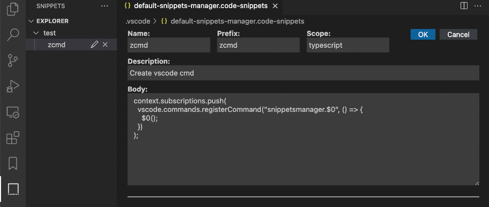
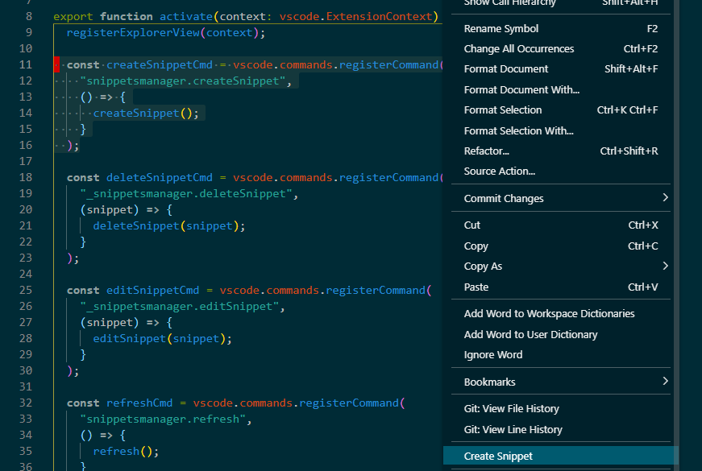
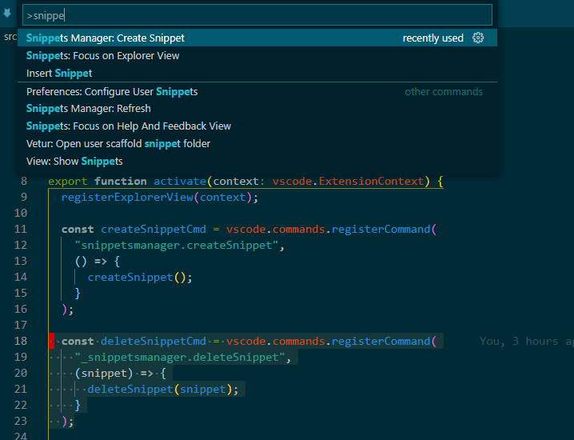
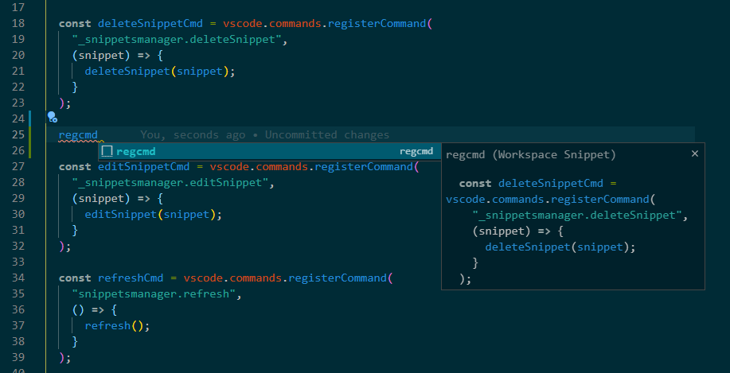

# Snippets Manager

Create and edit snippets easily.

## Features

### Edit snippets

Open `.code-snippets` in Snippets Editor.

### Create snippets

Select range to create a snippet.

Or create snippets by running command.

### Manage snippets

Edit or delete snippets.

### Use snippets

## Release Notes

### [TODO]

- Jump to selected snippet when click snippets.
- Edit selected snippet when click edit snippet.

### [Unreleased]

### v0.0.6

- Added features show all `.code-snippets` in explorer.
- Added features toggle source and editor.

- Fix bug when open empty snippet file.

### v0.0.5

- Added features add snippets in editor.

### v0.0.4

- Added features `.code-snippets` file editor.

### v0.0.3

- Changed icon and keywords.

### v0.0.2

- Changed icon.

### v0.0.1

- Added features create, edit and delete snippets.
