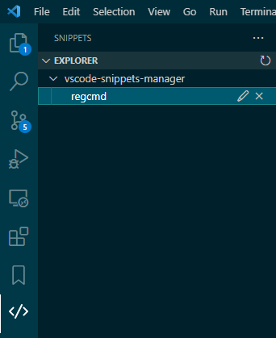
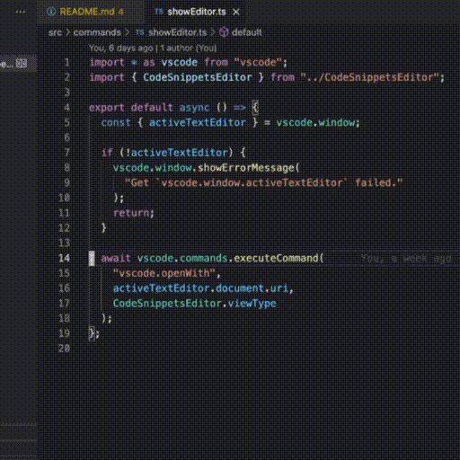
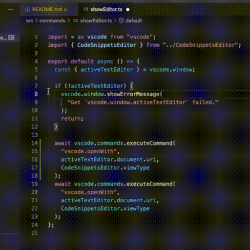
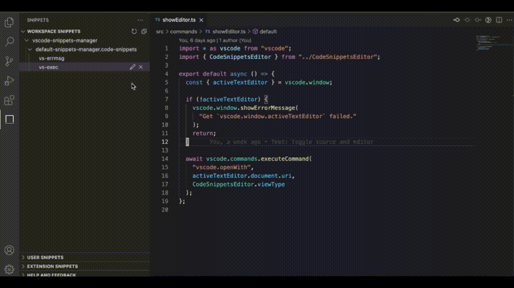

# Snippets Manager

Create and edit snippets easily.

## Features

### Manage snippets

Create, edit or delete snippets.



### Create snippets

Select range to create a snippet.



Or create snippets by running command.



### Edit snippets

Open `*.code-snippets` in Snippets Editor.

You can right-click `*.code-snippets` file then left-click the `Open Whit...` option to select other editors to open `*.code-snippets` file or set the default editor to open `*.code-snippets` file.



## Install via CLI

```bash
code --install-extension zjffun.snippetsmanager
```

## Release Notes

### [TODO]

### [Unreleased]

### v0.0.11

- Added features create snippet to specified file.
- Added features ask save to user snippets when can't find `activeWorkspaceFolder`.

### v0.0.10

- Fix bug when editor open with a malformed file.
- Fix bug editor state incorrect.
- Fix bug click edit snippet not work.

### v0.0.9

- Added features jump to selected snippet when click snippets.
- Added features edit selected snippet when click edit snippet.
- Added features support explorer file open editor.

- Fix bug when parse snippets file error.

### v0.0.8

- Fix bug when have no `.vscode` folder.

### v0.0.6

- Added features show all `*.code-snippets` in explorer.
- Added features toggle source and editor.

- Fix bug when open empty snippets file.

### v0.0.5

- Added features add snippets in editor.

### v0.0.4

- Added features `*.code-snippets` file editor.

### v0.0.3

- Changed icon and keywords.

### v0.0.2

- Changed icon.

### v0.0.1

- Added features create, edit and delete snippets.
