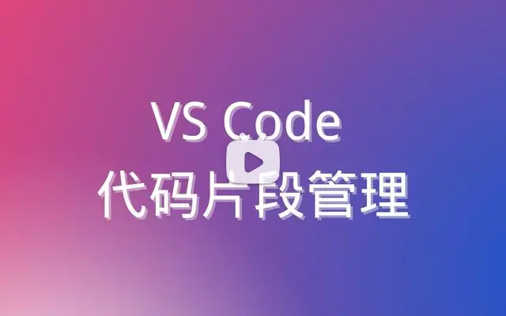

# 代码片段管理

[English](./README.md) | 简体中文

轻松地创建和修改代码片段。

这个拓展程序基于 VS Code 内置的代码片段功能，使用简单的界面让代码片段的创建、修改、编辑、删除和查找更加容易。这个拓展程序支持用户自定义、全局和安装的拓展程序的代码片段。

[](https://player.bilibili.com/player.html?aid=683633468&bvid=BV1jS4y1w7SW&cid=711074429&page=1)

## 功能

### 管理代码片段

创建、修改、编辑、删除和查找代码片段。


### 创建代码片段。

通过选择一段代码创建代码片段。


### 编辑代码片段

使用代码片段编辑器打开和编辑 `*.code-snippets` 文件。


注意：

- 修改拓展程序代码片段后，需重新加载 VS Code（按 `F1`，然后执行 `Reload Window`）才能生效。

#### 在文本编辑器中编辑代码片段主体

您可以通过点击“Body”旁边的编辑按钮按钮在文本编辑器中编辑代码片段主体。


#### 撤销/重做

这个拓展程序提供了一个自定义的 VS Code 编辑器，所以您可以使用 VS Code 的快捷键来撤销/重做。默认在 Windows 系统撤销是 `Ctrl+Z` 重做是 `Ctrl+Shift+Z`, 在 macOS 系统撤销是 `⌘Z` 重做是 `⇧⌘Z`。

#### 选择其他编辑器打开 `*.code-snippets` 文件

您可以右键单击 `*.code-snippets` 文件，然后左键单击 `Open Whit...` 选择使用其他编辑器打开 `*.code-snippets` 文件或更改 `*.code-snippets` 文件的默认编辑器。

### 搜索代码片段

搜索工作区、用户或拓展程序的代码片段。


## 配置

### `snippetsManager.autoCloseSnippetBodyEditor`

控制是否保存后自动关闭代码片段主体编辑器，默认是 `true`。

## 通过命令行安装

```bash
code --install-extension zjffun.snippetsmanager
```

## [更新日志](./CHANGELOG.md)

## [贡献](./CONTRIBUTING.md)
